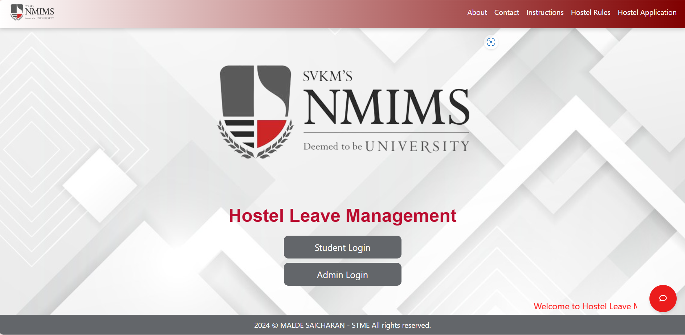

# 🏨 Hostel Leave Management System for NMIMS



## 📌 Overview
Welcome to the **Hostel Leave Management System** – your one-stop digital solution for hassle-free leave requests! Say goodbye to paperwork and hello to efficiency. This system:
- 🚀 **Digitizes** the leave approval process
- 🔄 **Connects** students, administrators, and rectors in real-time
- 📢 **Notifies** you instantly about leave approvals or rejections
- 📊 **Simplifies** record-keeping with easy report generation

---

## 🎯 Key Features
| 🚀 Feature | ✨ Description |
|-----------|--------------|
| **📌 Student Dashboard** | Easily apply for and track leave requests from anywhere |
| **🔗 Dual Approval Workflow** | Academic leaves require two-step approval; non-academic leaves get streamlined |
| **📊 Real-time Status Updates** | Stay updated with instant leave application progress |
| **📩 Automated Notifications** | Receive email alerts for approvals and rejections |
| **📂 Reporting Tools** | Generate Excel reports with a single click |
| **📱 Mobile-Friendly Interface** | Enjoy full functionality across all devices |

---

## 🛠️ Technology Stack
🖥 **Frontend**: HTML5, CSS3, Bootstrap 5  
⚙️ **Backend**: PHP 8.1, MySQL 8.0  
📦 **Key Libraries**:  
✅ PhpSpreadsheet (for report generation)  
✅ PHPMailer (for automated notifications)  

---

## 🚀 Getting Started
### 🎯 Prerequisites
Before you begin, ensure you have:
- ✅ PHP 8.0+
- ✅ MySQL 5.7+
- ✅ Apache/Nginx web server

### 📥 Installation
```bash
git clone https://github.com/saicharan0623/hostel-leave-management.git
cd hostel-leave-management
```

🔧 **Setup Database:** Import the provided SQL file into MySQL.  
🔑 **Update Credentials:** Modify `config.php` with your database details.  
🚀 **Run the Project:** Start your local server and enjoy seamless leave management!  

---

## 🔮 Future Roadmap
🚀 **Q2 2025:** AI-powered leave predictions based on usage patterns  
📲 **Q3 2025:** QR Code-based instant approvals for rectors  
🌙 **Q4 2025:** Dark mode and enhanced accessibility  
📱 **Q1 2026:** Full-fledged mobile app for iOS & Android  

---

## 🤝 How to Contribute
Want to make this system even better? Join us! 🎉
1️⃣ Fork the repository  
2️⃣ Create a feature branch (`git checkout -b feature/AmazingFeature`)  
3️⃣ Commit your changes (`git commit -m 'Add some AmazingFeature'`)  
4️⃣ Push to the branch (`git push origin feature/AmazingFeature`)  
5️⃣ Open a Pull Request 🎯  

---

## 📜 License
🔖 This project is licensed under the **MIT License** - see the [LICENSE](LICENSE) file for details.  

---

### 💡 Fun Fact
💡 **80% of students forget to apply for leave until the last moment.** Don’t be that student! Use our system and stay ahead. 😉

---
<p align="center">🚀 Made with ❤️ at NMIMS Hyderabad 🚀</p>
